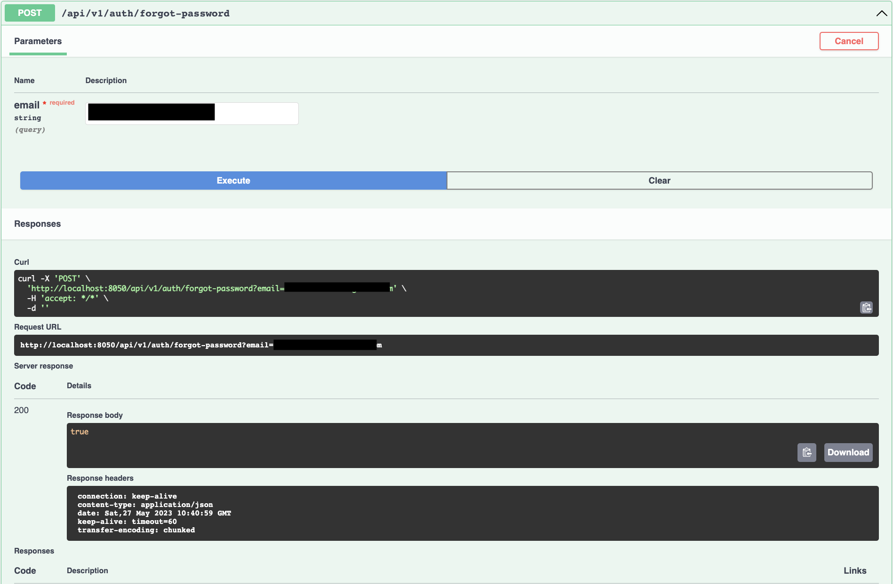

# YEMEK TARİFİ

## AÇIKLAMA
### Bu proje kullanıcınin giriş aksiyonları, programda bulunan sadece adminlerin ekleyebildiği tariflere yorum yapıp puan vermesi için yazılmış bir projedir.

## KULLANILAN TEKNOLOJİLER,VERİ TABANLARI VE PROGLAMLAMA DİLLERİ
### Programlama dilleri:Java,Spring Boot
### Veritabanları: PostgreSQL,MongoDB
### Servisler arasındaki HTTP istekleri: OpenFeign
### Kuyruk teknolojisi: RabbitMQ
### Cacheleme işlemi: Redis
### Loglama işlemi: @Slf4j

#### Register methodunda şifre regex ve size ile sınırlandırılmıştır,repassword ile aynı verilmesi gerektiğide kontrol edilmiştir. 
#### Auth postgre veritabanı ile çalışıyor, userprofile mongo ile burada kayıt yapılınca userprofile veri tabanınada veriler gidiyor. 

#### Register yaptıktan sonra maile activate status kodunuz gelir,bu kod ile hesabınızı aktif edebilirsiniz.

#### Mailimize gelen aktivasyon kodu ile hesabımızı aktif ediyoruz.

#### Username ve password ile giriş yapıyoruz.

#### Parola unutulduğu zaman maile bir parola gitmesi için email ister.

#### Şifre sıfırlamak için maile sistemin ürettiği yeni şifre geliyor.

#### User update işlemi

#### Password Change

### Recipeleri favoriye ekliyoruz.

#### Delete User

#### Yorum yapılıyor, yapılan yorumlar recipeye de ekleniyor.

#### Yapılan yorumlar siliniyor,burada silinen yorumlar recipede de silinecek şekilde tasarlandı.

#### Puan veriliyor, verilen puanlar recipeye de ekleniyor.

#### Verilen puanlar siliniyor,burada silinen puanlar recipede de silinecek şekilde tasarlandı.

#### Kategoriler ekleniyor.

#### Tarifler ekleniyor.Burada puan,yorum ve içerikler yer almakta.

#### Favoriye eklediğiniz recipelerin kategorisinde bir yemek eklenirse size mail gelmesini sağlıyor.

#### Tariflerin silinmesini sağlıyor.

#### Tariflerin update edilmesini sağlar.

#### Bu filtreleme işlemi kaloriyi sıralamaya yarar.

#### Bu filtreleme kategorileri filtrelemeye yarar.

#### Tariflerin ismi ile filtreleme yapmaya yarar.

#### Tariflerin içerdiği yemek ismi ile filtreleme yapmaya yarar.

